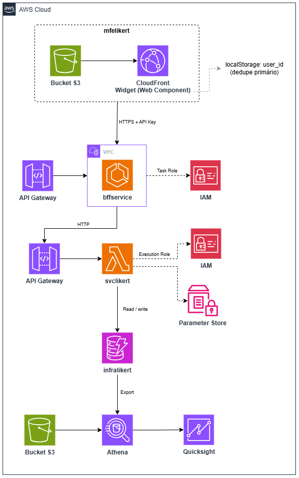

# infra-likert

Infraestrutura como código (Terraform) responsável pelo provisionamento das tabelas DynamoDB (`tb_usuarios` e `tb_avaliacoes`) do projeto Likert. Este repositório concentra os recursos de dados compartilhados, consumidos pelos serviços `bffservice` e `svclikert`.

## 📌 Arquitetura

## 🔄️ Fluxos

Cada fluxo de avaliação (ex: um período de 3 semanas em uma aplicação específica) é configurada manualmente no AWS Parameter Store, sem passar pelo Terraform — isso mantém o cadastro de novas campanhas rápido e independente do ciclo de infraestrutura.
